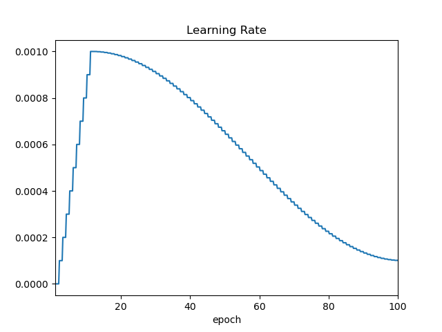
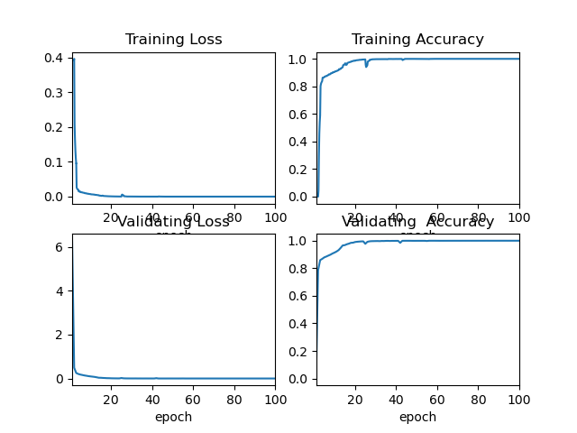

# PCB_Transformer
## Introduction
Please cited as J. Chen et al., "GPCB Routing: Generative Pre-Trained Transformers Based Printed Circuit Board Routing Method," in IEEE Transactions on Computer-Aided Design of Integrated Circuits and Systems, doi: 10.1109/TCAD.2024.3486241.
 
A Generative Pre-Trained model specifically for PCB Routing Domain, developed by the Firemind team led by Professor Jienan Chen 
of National Laboratory of Communication Anti-Interference at the University of Electronic Science and Technology of China.
## Description of each document 
- preprocess_data：Store data set
- encode_table：Store the length of the cap code table, flow code table, and line sequence code table
·flow_encode_table.json：flow code table  
·cap_encode_table.json: cap code table  
·start_end_size.pkl：The number of starting point codes is stored in dictionary format
- envs：Store the packages needed for visual flow presentation
- out_train：Store the saved model parameters and the loss and accuracy curves of training set and test set during model training.
  There is a trained model in "master" branch, which enables us test routing result by it.Pull "master" branch to load training checkpoint.  
- model.py：Model architecture
- train.py：Training
- configurator.py：Configurator of train.py
- sample.py：Generate code for a case using a trained model
- run.py：main function of the project

## Environmental demand
- Below pytorch version 2.0, the rest of the library environment can be installed according to the code requirements
- To use torch.pile () to speed up the training process, pytorch version 2.0 and above is required

## Usage method
### 1. Wiring tests using trained model
（1）There is a trained model in the ***./out_train***

```
mode = "sample"
$ python run.py
```
### 2. Traning a model from scratch
（1）Place all pkl files in the pre-trained coded data set generated by the PCB Semantic Automatic Conversion Script ***./data_base***  
（2）Put the flux encoding table and flow encoding table generated by PCB Semantic Automatic Conversion Script (**_cap_encode_table and flow_encode_table_**) in the ***./encode_table***  
（3）Training a model
- Single GPU training:
```
mode = "train"
$ python run.py
```
- DDP:
```python
# choose backend
backend = 'gloo'  # 'nccl', 'gloo', etc.
```
```
To run with DDP on 4 gpus on 1 node, example:
$ torchrun --standalone --nproc_per_node=4 train.py

To run with DDP on 4 gpus across 2 nodes, example:
- Run on the first (master) node with example IP 123.456.123.456:
$ torchrun --nproc_per_node=8 --nnodes=2 --node_rank=0 --master_addr=123.456.123.456 --master_port=1234 train.py
- Run on the worker node:
$ torchrun --nproc_per_node=8 --nnodes=2 --node_rank=1 --master_addr=123.456.123.456 --master_port=1234 train.py
```
- Choose the way to initialize the model
```python
# ./train.py 
init_from = 'scratch'  # 'scratch' or 'resume'
```
- Check training loss and accuracy
```
$ python show_loss_and_accuracy.py
```
 
   
（4）Wiring tests
```
mode = "sample"
$ python run.py
```
- Sets how many times to predict a case, and then selects the optimal prediction result
```python
# ./sample.py 
sample_times = 4
